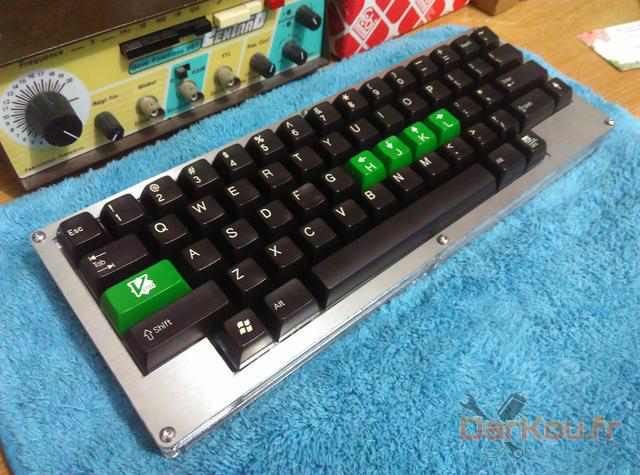

# MX HHKB rev2

## Render

## Available layouts

* Capslock
  * Classic
  * Stepped

* Bottom row
  * 1.25U - 1.25U - 6.25U - 1.25U - 1.25U
  * 1U - 1.5U - 6U - 1.5U - 1U
  * 1U - 1.25U - 6.25U - 1.25U - 1U
  * 1U - 1.5U - 7U - 1.5U 

## TODO
- [x] Draw all layers
- [x] Verify switch layer
- [ ] Verify top layers